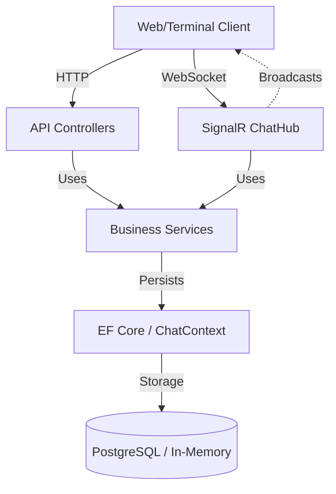

# System Architecture

This document describes the architectural patterns and project structure of the `c-chat` backend.

## Overview

The application is built using **.NET 9** and follows a clean, modular architecture. It provides a RESTful API for management tasks and a **SignalR** hub for real-time communication.

## Project Structure

The project is organized into several key directories:

```text
TerminalChatApp.Backend/
├── Controllers/      # Handles HTTP REST requests (Auth, Chats, Invitations)
├── Hubs/             # Manages real-time SignalR connections and messaging
├── Services/         # Contains business logic and shared utilities (JWT, Database)
├── Models/           # Defines Data Transfer Objects (DTOs) and Database entities
├── Data/             # Contains the Entity Framework DbContext
└── Program.cs        # Application entry point and service configuration
```

## Architectural Patterns

### 1. Controllers (REST API)
Controllers handle static operations such as user registration, login, and historical message retrieval. They interact with `ChatContext` and `Services`.

### 2. SignalR Hubs (Real-time)
The `ChatHub` is the heart of real-time functionality. It tracks online status and broadcasts messages to chat groups.

### 3. Service Layer
- **JwtService**: Dedicated to generating and validating JSON Web Tokens for secure authentication.
- **DatabaseService**: Manages database initialization and migrations, abstracting the difference between In-Memory and PostgreSQL storage.

### 4. Data Layer (Entity Framework Core)
The application uses EF Core to interact with the database. It's configured to support both an **In-Memory** database for development and **PostgreSQL** for production.

## Flow Diagram



## Security

- **Authentication**: JWT-based bearer tokens.
- **Password Hashing**: BCrypt.Net-Next for secure password storage.
- **Authorization**: Role-based (Admin participants in chats) and token-based (Authorize attribute).
